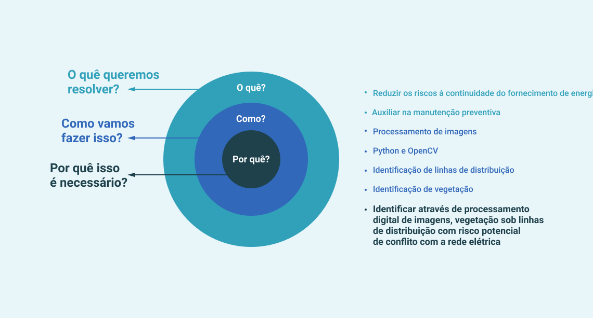

## TCC apresentado para conclusão do curso de Engenharia Mecatrônica

    &nbsp; &nbsp; &nbsp; &nbsp; &nbsp; &nbsp; &nbsp; 

>:robot: &nbsp; <b> Mecatrônica </b>  
A graduação em [Engenharia Mecatrônica](https://web.satc.edu.br/graduacao/engenharia-mecatronica/) possui carater multidisciplinar, contemplando conhecimentos nas áreas de mecânica, informática industrial, eletroeletrônica e de áreas afins como a robótica, automação industrial, sistemas hidráulicos e pneumáticos, controle de processos e projetos mecânicos, contribuindo tecnologicamente e socialmente na construção e melhoria de processos e procedimentos industriais.

 

### Processamento digital de imagens para identificação de vegetação sob linhas de distribuição de energia elétrica
Este trabalho de conclusão de curso buscou analisar o processamento digital de imagens, como um meio alternativo para a realização do monitoramento da invasão de vegetação sob linhas de distribuição de energia elétrica :zap:.

**Para alcançar os objetivos pretendidos, procurou-se responder as seguintes pergutas:**

    

**Ferramentas utilizadas:**
- [Python](https://https://www.python.org/)
- [OpenCv](https://www.opencv.org/)

 

> :fire: *Este trabalho foi também publicado e apresentado no 12º CBPE - Congresso brasileiro de planejamento energético*
